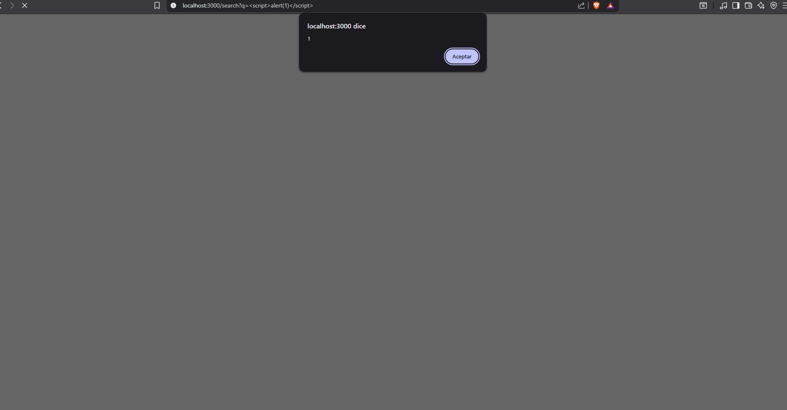
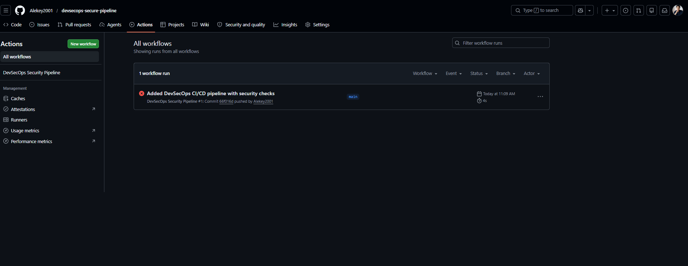

## 🔍 Vulnerability Identified
- Type: Cross-Site Scripting (XSS)
- Endpoint: `/search?q=`
- Severity: High
## 📄 Full Report AWS CONFIG 
👉 [View Detailed Report](./reports/AWS-report.md)
## 💥 Proof of Concept
http://localhost:3000/search?q=

## CI/CD Status

⚠️ Note: GitHub Actions workflows are currently blocked due to a billing-related account restriction.

- Issue identified: GitHub account lock affecting Actions execution
- Troubleshooting performed: billing cleanup, account verification
- Resolution: support ticket submitted to GitHub

This reflects a real-world DevSecOps scenario where infrastructure issues must be diagnosed and escalated.

Pipeline configuration is complete and ready to run once the restriction is lifted.
## ⚙️ CI/CD Security Pipeline

This project includes an automated DevSecOps pipeline using GitHub Actions:

- Dependency scanning (npm audit)
- Static code analysis (CodeQL)
- Continuous integration on every push
# OWASP ZAP Security Scan Report

## Target
http://localhost:3000

## Tool
OWASP ZAP (DAST)

## Summary
A dynamic application security test (DAST) was performed against the Node.js application.

## Findings
## Security Improvements

Using OWASP ZAP, multiple security misconfigurations were identified and mitigated:

- Implemented Content Security Policy (CSP) with strict directives
- Added protection against Clickjacking (frame-ancestors, X-Frame-Options)
- Disabled server fingerprinting (X-Powered-By header)
- Enforced MIME type checking (X-Content-Type-Options)

These improvements significantly reduce attack surface against XSS, injection, and UI redressing attacks.
Implemented HTTP security hardening with Helmet and custom CSP. Mitigated XSS, clickjacking, and information disclosure risks. Validated headers manually and with OWASP ZAP, reducing findings to low/acceptable levels.
### 1. Cross-Site Scripting (XSS)
- Risk: High
- Description: Reflected XSS vulnerability detected
- Impact: Allows execution of arbitrary JavaScript in user browser
- Recommendation: Sanitize user input and implement output encoding
## 📄 Full Report
👉 [View Detailed Report](./reports/xss-report.md)
## 📄 Full Report
👉 [View Detailed Report](./reports/zap-report.md)
## 📸 Evidence

