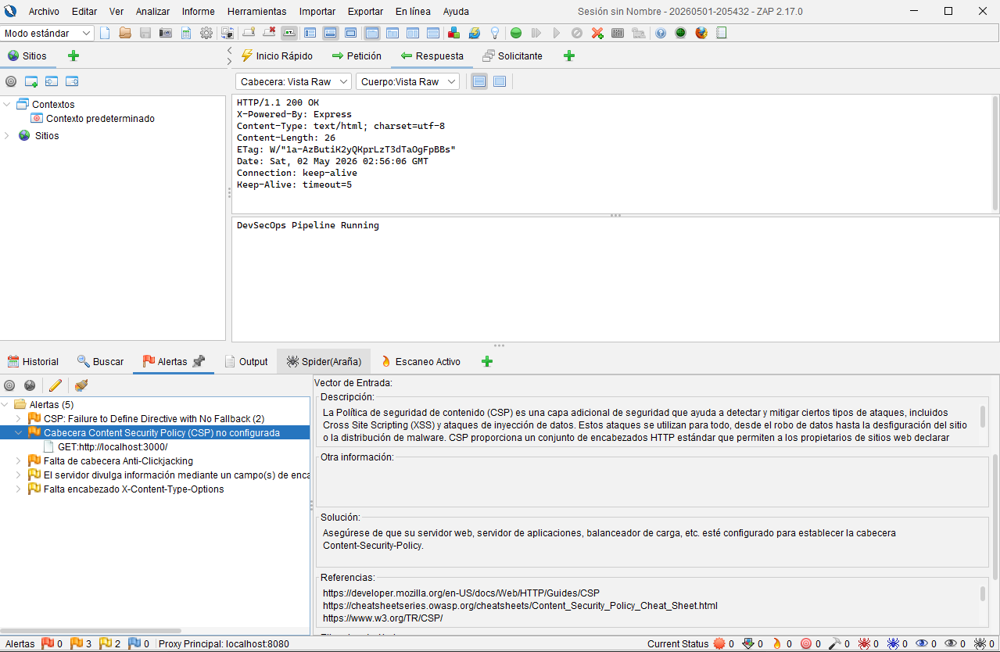

# OWASP ZAP Security Scan Report

## Target
http://localhost:3000

## Tool
OWASP ZAP (DAST)

## Summary
A dynamic application security test (DAST) was performed against the Node.js application.

## Findings

### 1. Cross-Site Scripting (XSS)
- Risk: High
- Description: Reflected XSS vulnerability detected
- Impact: Allows execution of arbitrary JavaScript in user browser
- Recommendation: Sanitize user input and implement output encoding

### 2. Missing Security Headers
- Risk: Medium
- Description: Missing HTTP security headers
- Recommendation:
  - Content-Security-Policy
  - X-Content-Type-Options
  - X-Frame-Options

## Evidence

## Conclusion

The application contains critical vulnerabilities that must be remediated before production deployment.